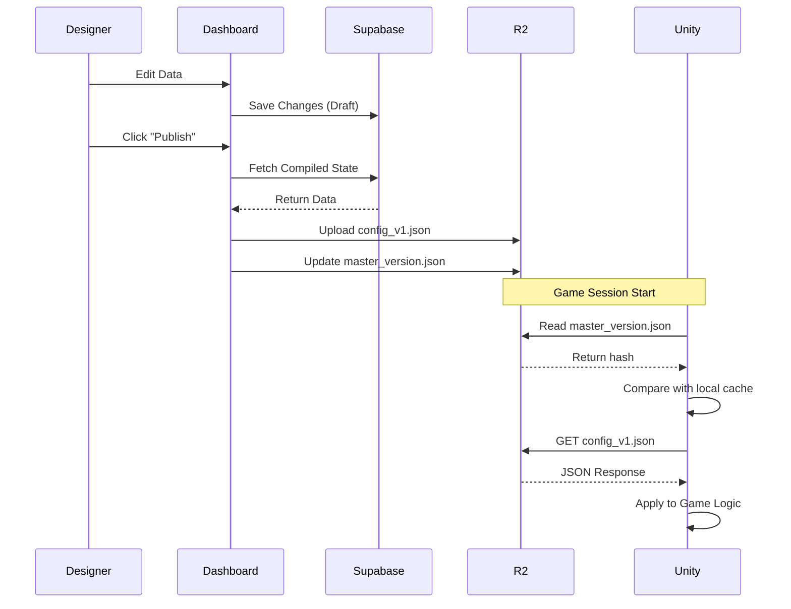

# Data Flow & Publishing Lifecycle

This document describes the step-by-step process of how data moves from a designer's input to a player's device.

## 🔄 The Publishing Loop

The lifecycle of a configuration change is divided into three distinct phases: **Authoring**, **Distribution**, and **Consumption**.

### 1. Authoring Phase (Designer Action)
- **Input**: A designer logs into the Next.js Dashboard.
- **Modification**: Changes are made to a specific schema (e.g., increasing a "Gold Multiplier").
- **Persistence**: Data is saved to **Supabase (PostgreSQL)**. At this stage, changes are "Staged" and not yet visible to players.

### 2. Distribution Phase (Publishing)
When the designer clicks the "Publish" button:
1. **Compilation**: An Edge Function or Background Service queries the database for the full active dataset.
2. **Serialization**: The relational data is flattened into an optimized `.json` format.
3. **Versioning**: A unique version hash (e.g., `v1.2.4`) is generated based on the content hash.
4. **Deployment**:
    - The JSON file is uploaded to **Cloudflare R2**.
    - A global `version.json` pointer is updated to point to the new hash.

### 3. Consumption Phase (Client Sync)
When the Unity game starts (or on a periodic poll):
1. **Version Check**: The Unity SDK pings the `version.json` on the CDN.
2. **Hash Comparison**: The client compares the remote hash with its local `PlayerPrefs` or persistent storage.
3. **Download**: If a mismatch is detected, the SDK downloads the new static config file.
4. **Activation**: The game engine parses the JSON and updates the singleton/dependency injection container with the values for the new session.

## 📊 Sequence Diagram

## 🛡 Safety & Rollbacks
- **Validation**: Before publishing, the dashboard runs a "Dry Run" to ensure the generated JSON matches the schema expected by the Unity SDK version.
- **Atomic Updates**: The `master_version.json` update is the final step, ensuring players never download a partially uploaded configuration.
- **Instant Rollback**: To revert, a designer simply selects a previous version in the Dashboard and re-publishes it, updating the version pointer in seconds.
