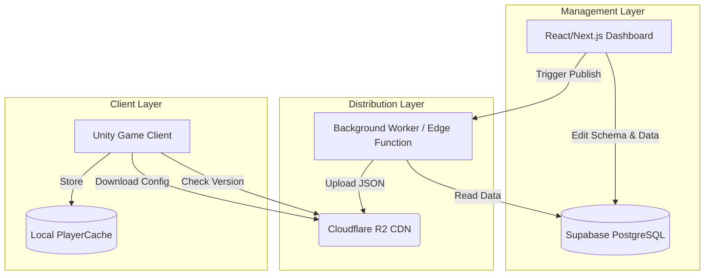

# Project Overview

## 🌌 Introduction
**Flux** is a high-performance Game Data Synchronization framework designed for Unity developers. It bridges the gap between game design and live operations, allowing for real-time balancing and remote configuration without requiring client-side updates.

## 🏗 High-Level Architecture
The system follows a "Write-Once, Deliver-Everywhere" philosophy, optimizing for high read availability and zero-cost distribution.

## 🛠 Core Components

### 1. Admin Dashboard (The Control Plane)
A centralized web interface where designers define:
- **Schemas**: The structure of game data (e.g., Stats, Equipment, Levels).
- **Entries**: The actual values for each schema.
- **Environments**: Development, Staging, and Production stacks.

### 2. Supabase Backend (The Source of Truth)
Handles relational data storage, user authentication for designers, and potentially social auth for players.
- **Auth**: Secure login for administrative access.
- **Database**: PostgreSQL with Row-Level Security (RLS) to protect sensitive configurations.

### 3. Cloudflare R2 (The Data Plane)
Acts as a globally distributed, S3-compatible object store.
- **Static Assets**: Compiled `.json` or binary files.
- **Zero Egress**: Eliminates bandwidth costs typical of traditional cloud providers.

### 4. Unity SDK (The Consumer)
A lightweight C# package integrated into the game.
- **Auth Interface**: Connects players to Supabase Auth.
- **Sync Engine**: Handles versioning, hashing, and incremental updates.

## 🚀 Key Philosophies
- **Offline First**: The SDK ensures the game remains playable using the last cached configuration if the network is unavailable.
- **Safety**: Built-in validation ensures that "broken" configurations cannot be published to production.
- **Scalability**: Designed to handle millions of concurrent players by shifting load from the database to the edge CDN.
