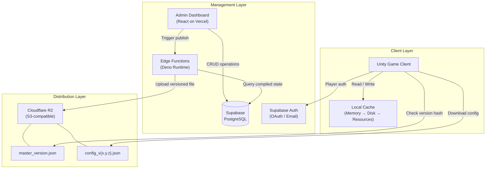

# 02 — System Architecture

> **Document Type:** Architecture Overview
> **Audience:** Engineers, architects, technical leads

---

## 2.1 Architecture Overview

Unity Flux follows a **three-layer architecture** that enforces strict separation between data management, content distribution, and client consumption.

```
┌─────────────────────────────────────────────────────────────────┐
│                      MANAGEMENT LAYER                           │
│  ┌──────────────────┐     ┌──────────────────────────────────┐  │
│  │  Admin Dashboard  │────▶│  Supabase (PostgreSQL + Auth)    │  │
│  │  (React / Vercel) │     │  • Row-Level Security            │  │
│  └──────────────────┘     │  • Edge Functions (Compiler)      │  │
│                            └──────────────┬───────────────────┘  │
├───────────────────────────────────────────┼─────────────────────┤
│                      DISTRIBUTION LAYER   │                     │
│                            ┌──────────────▼───────────────────┐  │
│                            │  Cloudflare R2                    │  │
│                            │  • Versioned JSON configs         │  │
│                            │  • master_version.json pointer    │  │
│                            │  • Zero-egress global delivery    │  │
│                            └──────────────┬───────────────────┘  │
├───────────────────────────────────────────┼─────────────────────┤
│                      CLIENT LAYER         │                     │
│                            ┌──────────────▼───────────────────┐  │
│                            │  Unity SDK (C#)                   │  │
│                            │  • Version check & sync           │  │
│                            │  • Local cache (3-tier fallback)  │  │
│                            │  • Player authentication          │  │
│                            └──────────────────────────────────┘  │
└─────────────────────────────────────────────────────────────────┘
```

---

## 2.2 Component Diagram



---

## 2.3 Component Responsibilities

### 2.3.1 Admin Dashboard

| Aspect          | Detail                                                    |
| :-------------- | :-------------------------------------------------------- |
| **Technology**  | React (App Router), Tailwind CSS                          |
| **Hosting**     | Vercel (edge middleware, serverless functions)             |
| **Role**        | Schema definition, data editing, version publishing       |
| **Consumers**   | Game designers, LiveOps managers                          |

### 2.3.2 Supabase Backend

| Aspect          | Detail                                                    |
| :-------------- | :-------------------------------------------------------- |
| **Database**    | PostgreSQL with JSONB for dynamic schema storage          |
| **Auth**        | Email/password for admins; OAuth (Google, Facebook) for players |
| **Security**    | Row-Level Security (RLS) on all tables                    |
| **Functions**   | Edge Functions (Deno) for data compilation and webhooks   |

### 2.3.3 Cloudflare R2

| Aspect          | Detail                                                    |
| :-------------- | :-------------------------------------------------------- |
| **Type**        | S3-compatible object storage                              |
| **Access**      | Public read (via custom domain) / Private write (API key) |
| **Cost Model**  | Zero egress fees — pay only for storage and operations    |
| **Caching**     | Immutable config files (long TTL), short TTL on version pointer |

### 2.3.4 Unity SDK

| Aspect          | Detail                                                    |
| :-------------- | :-------------------------------------------------------- |
| **Language**    | C# (.NET Standard 2.1)                                   |
| **Distribution**| Unity Package Manager (UPM) via Git URL                  |
| **Dependencies**| Newtonsoft.Json                                           |
| **Pattern**     | Singleton (`FluxManager`) with async/await API            |

---

## 2.4 Design Principles

| Principle                    | Description                                                                                          |
| :--------------------------- | :--------------------------------------------------------------------------------------------------- |
| **Separation of Concerns**   | Each layer has a single responsibility: manage, distribute, or consume.                              |
| **Immutable Versions**       | Published configs are never modified in place — new versions create new files.                       |
| **Edge-First Delivery**      | Player traffic never touches the database; all reads go through the CDN.                             |
| **Offline Resilience**       | The client always has a usable config via the 3-tier cache fallback.                                 |
| **Schema-Driven Flexibility**| Data structures are defined at runtime, not compile time, enabling any game genre.                   |
| **Atomic Publishing**        | The version pointer is updated last, ensuring clients never fetch partially uploaded configs.         |

---

## 2.5 Communication Protocols

| Path                        | Protocol  | Auth Method               | Direction        |
| :-------------------------- | :-------- | :------------------------ | :--------------- |
| Dashboard ↔ Supabase        | HTTPS     | Supabase anon/service key | Bidirectional    |
| Edge Function → R2          | HTTPS     | R2 API key (HMAC-signed)  | Write-only       |
| Unity SDK → R2              | HTTPS     | Public (read-only)        | Read-only        |
| Unity SDK → Supabase Auth   | HTTPS     | Supabase anon key         | Bidirectional    |

---

## 2.6 Scalability Characteristics

```
                   Writes (Low Volume)              Reads (High Volume)
                   ┌────────────────┐               ┌────────────────┐
  Designers ──────▶│   Supabase DB  │               │  Cloudflare R2 │◀────── Players
  (1-10 users)     │   (PostgreSQL) │               │  (Edge CDN)    │       (Millions)
                   └────────────────┘               └────────────────┘
                   ~100 writes/day                   ~Unlimited reads
                   Low cost (free tier)              Zero egress cost
```

The architecture inherently separates write traffic (low volume, from designers) from read traffic (high volume, from players), allowing the system to scale to millions of concurrent players without database pressure.

---

**Previous:** [01 — Project Overview](01-project-overview.md)
**Next:** [03 — Database Design](03-database-design.md)
