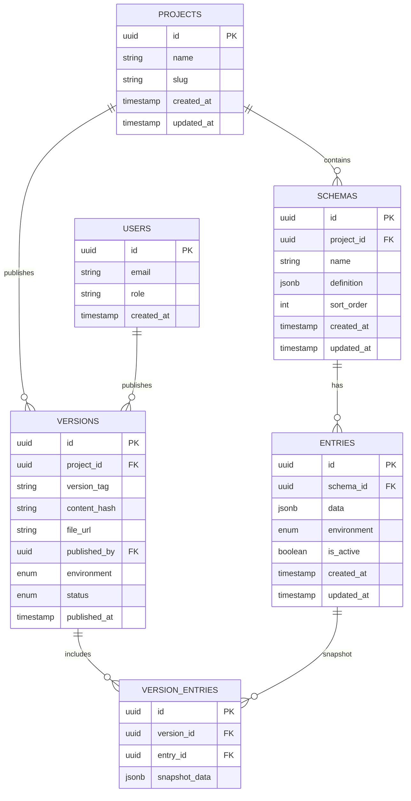

# 03 — Database Design

> **Document Type:** Backend Specification
> **Audience:** Backend engineers, database architects

---

## 3.1 Overview

Unity Flux uses **Supabase** (managed PostgreSQL) as the single source of truth for all configuration data. The database stores raw, mutable data that is later compiled into immutable static files for distribution.

**Key Design Decisions:**
- **JSONB columns** for dynamic schema storage — avoids schema migrations when game data structures change.
- **Row-Level Security (RLS)** on every table — enforces access control at the database level.
- **Environment isolation** — data is partitioned by environment (`development`, `staging`, `production`).

---

## 3.2 Entity-Relationship Diagram



---

## 3.3 Table Specifications

### 3.3.1 `projects`

Represents a game or application that uses Flux.

| Column       | Type        | Constraints       | Description                        |
| :----------- | :---------- | :---------------- | :--------------------------------- |
| `id`         | `UUID`      | PK, default gen   | Unique project identifier          |
| `name`       | `TEXT`      | NOT NULL           | Display name (e.g., "Idle Heroes") |
| `slug`       | `TEXT`      | UNIQUE, NOT NULL   | URL-safe identifier                |
| `created_at` | `TIMESTAMPTZ` | DEFAULT now()   | Creation timestamp                 |
| `updated_at` | `TIMESTAMPTZ` | DEFAULT now()   | Last modification timestamp        |

### 3.3.2 `schemas`

Defines the structure of a data group within a project.

| Column       | Type        | Constraints       | Description                                          |
| :----------- | :---------- | :---------------- | :--------------------------------------------------- |
| `id`         | `UUID`      | PK                | Unique schema identifier                             |
| `project_id` | `UUID`     | FK → projects.id  | Parent project                                       |
| `name`       | `TEXT`      | NOT NULL           | Schema name (e.g., "EnemyStats", "LevelConfig")     |
| `definition` | `JSONB`     | NOT NULL           | Field definitions with types and constraints         |
| `sort_order` | `INTEGER`   | DEFAULT 0          | Display ordering in the dashboard                    |
| `created_at` | `TIMESTAMPTZ` | DEFAULT now()   |                                                      |
| `updated_at` | `TIMESTAMPTZ` | DEFAULT now()   |                                                      |

**Example `definition` value:**
```json
{
  "fields": [
    { "name": "base_health", "type": "integer", "min": 1, "max": 99999 },
    { "name": "speed", "type": "float", "min": 0.1, "max": 100.0 },
    { "name": "element", "type": "enum", "values": ["fire", "water", "earth", "wind"] },
    { "name": "is_boss", "type": "boolean", "default": false }
  ]
}
```

### 3.3.3 `entries`

Individual data records conforming to a schema.

| Column       | Type        | Constraints        | Description                              |
| :----------- | :---------- | :----------------- | :--------------------------------------- |
| `id`         | `UUID`      | PK                 | Unique entry identifier                  |
| `schema_id`  | `UUID`      | FK → schemas.id    | Parent schema                            |
| `data`       | `JSONB`     | NOT NULL            | Actual values matching schema definition |
| `environment`| `TEXT`      | CHECK constraint    | `development`, `staging`, or `production`|
| `is_active`  | `BOOLEAN`   | DEFAULT true        | Soft-delete flag                         |
| `created_at` | `TIMESTAMPTZ` | DEFAULT now()    |                                          |
| `updated_at` | `TIMESTAMPTZ` | DEFAULT now()    |                                          |

### 3.3.4 `versions`

Immutable snapshots of published configurations.

| Column         | Type        | Constraints        | Description                              |
| :------------- | :---------- | :----------------- | :--------------------------------------- |
| `id`           | `UUID`      | PK                 | Unique version identifier                |
| `project_id`   | `UUID`      | FK → projects.id   | Parent project                           |
| `version_tag`  | `TEXT`      | NOT NULL            | Semantic version (e.g., "1.2.4")         |
| `content_hash` | `TEXT`      | NOT NULL            | SHA-256 hash of compiled output          |
| `file_url`     | `TEXT`      | NOT NULL            | R2 object URL                            |
| `published_by` | `UUID`      | FK → users.id      | Designer who triggered the publish       |
| `environment`  | `TEXT`      | CHECK constraint    | Target environment                       |
| `status`       | `TEXT`      | CHECK constraint    | `active`, `superseded`, `rolled_back`    |
| `published_at` | `TIMESTAMPTZ` | DEFAULT now()    | Publication timestamp                    |

### 3.3.5 `version_entries`

Junction table that captures the exact state of each entry at the time of publishing (snapshot).

| Column          | Type     | Constraints          | Description                           |
| :-------------- | :------- | :------------------- | :------------------------------------ |
| `id`            | `UUID`   | PK                   | Unique record identifier              |
| `version_id`    | `UUID`   | FK → versions.id     | Parent version                        |
| `entry_id`      | `UUID`   | FK → entries.id      | Source entry                          |
| `snapshot_data`  | `JSONB` | NOT NULL              | Frozen copy of entry data at publish  |

---

## 3.4 Row-Level Security (RLS) Policies

All tables have RLS enabled. Access is controlled by the authenticated user's role.

| Table      | Policy Name           | Operation     | Rule                                                  |
| :--------- | :-------------------- | :------------ | :---------------------------------------------------- |
| `projects` | `admin_full_access`   | ALL           | `auth.role() = 'admin'`                               |
| `schemas`  | `admin_full_access`   | ALL           | `auth.role() = 'admin'`                               |
| `entries`  | `admin_manage`        | SELECT, INSERT, UPDATE | `auth.role() IN ('admin', 'editor')`          |
| `entries`  | `viewer_read`         | SELECT        | `auth.role() = 'viewer'`                               |
| `versions` | `admin_publish`       | INSERT        | `auth.role() = 'admin'`                               |
| `versions` | `all_read`            | SELECT        | `true` (all authenticated users)                       |

---

## 3.5 Authentication

### Admin Authentication

| Method          | Provider        | Use Case                          |
| :-------------- | :-------------- | :-------------------------------- |
| Email / Password | Supabase Auth  | Primary admin login               |
| SSO / SAML       | Supabase Auth  | Enterprise team integration       |

### Player Authentication (via Unity SDK)

| Method          | Provider              | Use Case                         |
| :-------------- | :-------------------- | :------------------------------- |
| Anonymous       | Supabase Auth         | Default — no sign-in required    |
| Google OAuth    | Supabase + Google     | Cross-device progression         |
| Facebook Login  | Supabase + Facebook   | Social features                  |
| Apple Sign-In   | Supabase + Apple      | iOS requirement compliance       |

---

## 3.6 Edge Functions

Supabase Edge Functions (Deno runtime) handle server-side logic.

### `compile-and-publish`

Triggered when a designer clicks "Publish" in the dashboard.

```
Input:  { project_id, environment, version_tag }
Process:
  1. Query all active entries for the project + environment
  2. Group entries by schema name
  3. Serialize into optimized JSON structure
  4. Compute SHA-256 content hash
  5. Upload compiled file to Cloudflare R2
  6. Update master_version.json pointer on R2
  7. Insert record into `versions` table
  8. Snapshot all entries into `version_entries`
Output: { version_id, content_hash, file_url }
```

### `notify-webhook` (Optional)

Sends notifications to external services when a new version is published.

```
Channels: Slack, Discord, custom HTTP endpoint
Payload:  { project, version, environment, published_by, timestamp }
```

---

**Previous:** [02 — System Architecture](02-system-architecture.md)
**Next:** [04 — Admin Dashboard](04-admin-dashboard.md)
