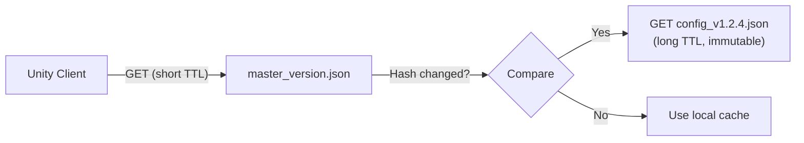

# 05 — Content Delivery (Cloudflare R2)

> **Document Type:** Infrastructure Specification
> **Audience:** Backend engineers, DevOps, infrastructure architects

---

## 5.1 Overview

Unity Flux uses **Cloudflare R2** as its content distribution layer. R2 is an S3-compatible object storage service that provides global edge delivery with **zero egress fees** — making it ideal for serving static configuration files to millions of concurrent game clients.

### Why R2 Over Alternatives?

| Criteria          | Cloudflare R2      | AWS S3              | GCP Cloud Storage   |
| :---------------- | :----------------- | :------------------ | :------------------ |
| Egress Cost       | **$0**             | $0.09/GB            | $0.12/GB            |
| Storage Cost      | $0.015/GB/mo       | $0.023/GB/mo        | $0.020/GB/mo        |
| S3 Compatibility  | Yes                | Native              | Partial             |
| Edge Caching      | Built-in (CF CDN)  | Requires CloudFront | Requires CDN        |
| Global PoPs       | 300+               | ~30 regions         | ~35 regions         |

---

## 5.2 Bucket Architecture

### Directory Structure

Each project maintains a clean, hierarchical structure inside the R2 bucket:

```
flux-configs/
├── {project-slug}/
│   ├── production/
│   │   ├── master_version.json          ← Version pointer (short TTL)
│   │   ├── config_v1.0.0.json           ← Immutable config snapshot
│   │   ├── config_v1.0.1.json
│   │   └── config_v1.2.4.json
│   ├── staging/
│   │   ├── master_version.json
│   │   └── config_v1.2.5-rc.1.json
│   └── development/
│       ├── master_version.json
│       └── config_v1.2.5-dev.json
```

### File Naming Convention

| File Type           | Pattern                              | Example                        |
| :------------------ | :----------------------------------- | :----------------------------- |
| Version pointer     | `master_version.json`                | —                              |
| Stable release      | `config_v{major}.{minor}.{patch}.json` | `config_v1.2.4.json`         |
| Release candidate   | `config_v{x.y.z}-rc.{n}.json`       | `config_v1.2.5-rc.1.json`     |
| Development build   | `config_v{x.y.z}-dev.json`          | `config_v1.2.5-dev.json`      |

---

## 5.3 File Formats

### `master_version.json`

The lightweight pointer file that clients check first. Designed for minimal payload and fast parsing.

```json
{
  "version": "1.2.4",
  "hash": "a3f8c9b2e1d4567890abcdef12345678",
  "file": "config_v1.2.4.json",
  "published_at": "2026-03-18T14:30:00Z",
  "published_by": "designer@studio.com"
}
```

| Field          | Type     | Description                                          |
| :------------- | :------- | :--------------------------------------------------- |
| `version`      | `string` | Semantic version tag                                 |
| `hash`         | `string` | SHA-256 hash of the config file content              |
| `file`         | `string` | Filename of the active config (relative to env dir)  |
| `published_at` | `string` | ISO 8601 timestamp                                   |
| `published_by` | `string` | Email of the publishing user                         |

### `config_v{x.y.z}.json`

The compiled configuration file containing all game data for the given version.

```json
{
  "meta": {
    "version": "1.2.4",
    "hash": "a3f8c9b2e1d4567890abcdef12345678",
    "compiled_at": "2026-03-18T14:30:00Z",
    "schema_count": 3,
    "entry_count": 47
  },
  "schemas": {
    "EnemyStats": [
      { "id": "enemy_001", "base_health": 100, "speed": 5.5, "element": "fire" },
      { "id": "enemy_002", "base_health": 250, "speed": 3.2, "element": "water" }
    ],
    "LevelConfig": [
      { "id": "level_01", "gold_multiplier": 1.0, "xp_multiplier": 1.0 },
      { "id": "level_02", "gold_multiplier": 1.5, "xp_multiplier": 1.2 }
    ]
  }
}
```

---

## 5.4 Caching Strategy

The caching strategy uses two distinct TTL policies based on file mutability:



### Cache Headers

| File Type            | `Cache-Control`                          | Rationale                                        |
| :------------------- | :--------------------------------------- | :----------------------------------------------- |
| `master_version.json`| `public, max-age=60, s-maxage=60`        | Short TTL — clients discover updates within 1 min|
| `config_v*.json`     | `public, max-age=31536000, immutable`    | Long TTL — content never changes once published  |

### Cache Invalidation

- **Version pointer** (`master_version.json`): Naturally expires after 60 seconds. No manual invalidation needed.
- **Config files**: Never invalidated — they are immutable. New versions create new files.

---

## 5.5 Access Control

| Operation | Method                        | Authentication                        |
| :-------- | :---------------------------- | :------------------------------------ |
| Read      | Public via custom domain      | None (protected by Cloudflare WAF)    |
| Write     | R2 S3-compatible API          | HMAC-signed requests or R2 API token  |
| Delete    | R2 S3-compatible API          | R2 API token (admin only)             |

### Custom Domain Setup

```
flux-cdn.yourstudio.com  →  CNAME  →  flux-configs.r2.cloudflarestorage.com
```

Cloudflare automatically provides:
- SSL/TLS termination
- DDoS protection (WAF)
- Edge caching across 300+ global PoPs

---

## 5.6 Cost Projections

| Metric                  | Free Tier          | Projected (1M DAU)     |
| :---------------------- | :----------------- | :--------------------- |
| Storage                 | 10 GB free         | ~500 MB ($0.008/mo)    |
| Class A ops (writes)    | 1M free/mo         | ~1,000/mo (negligible) |
| Class B ops (reads)     | 10M free/mo        | ~30M/mo (~$3/mo)       |
| Egress                  | **Always $0**      | **$0**                 |
| **Total**               | **$0**             | **~$3/mo**             |

> Even at scale, the cost of serving configs to millions of players is effectively free.

---

**Previous:** [04 — Admin Dashboard](04-admin-dashboard.md)
**Next:** [06 — Unity SDK](06-unity-sdk.md)
