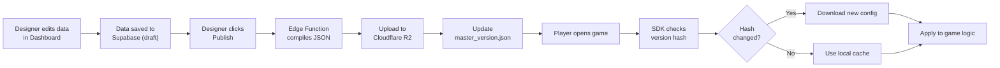
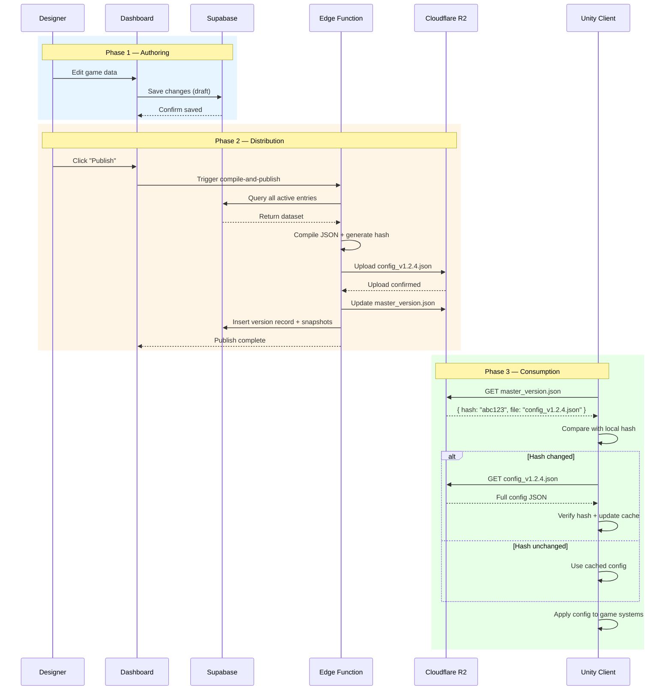

# 07 — Data Flow & Lifecycle

> **Document Type:** Process Specification
> **Audience:** All engineers (full-stack, backend, game client)

---

## 7.1 Overview

This document describes the complete lifecycle of a configuration change — from a designer's edit in the dashboard to its application in a player's game session. The flow is divided into three phases: **Authoring**, **Distribution**, and **Consumption**.

---

## 7.2 High-Level Flow



---

## 7.3 Phase 1 — Authoring

**Actors:** Game designer, LiveOps manager
**Systems:** Admin Dashboard, Supabase

### Steps

| Step | Action                          | System         | Detail                                                     |
| :--- | :------------------------------ | :------------- | :--------------------------------------------------------- |
| 1.1  | Designer logs in                | Dashboard      | Authenticated via Supabase Auth (email or SSO)             |
| 1.2  | Select project & environment    | Dashboard      | e.g., "Idle Heroes" → "staging"                            |
| 1.3  | Edit schema or entries          | Dashboard      | Changes are saved immediately to Supabase (auto-save)      |
| 1.4  | Review changes                  | Dashboard      | Dirty state indicators show unpublished modifications      |
| 1.5  | Changes are in "Draft" state    | Supabase       | Visible in dashboard only, not yet available to players     |

### State Diagram

```
  ┌────────┐     save      ┌───────┐    publish    ┌───────────┐
  │  Edit  │ ──────────▶   │ Draft │ ────────────▶  │ Published │
  └────────┘               └───────┘                └───────────┘
                               │                         │
                               │ discard                  │ rollback
                               ▼                         ▼
                          ┌──────────┐            ┌──────────────┐
                          │ Discarded│            │ Rolled Back  │
                          └──────────┘            └──────────────┘
```

---

## 7.4 Phase 2 — Distribution

**Actors:** Edge Function (automated)
**Systems:** Supabase, Cloudflare R2

### Steps

| Step | Action                          | System          | Detail                                                    |
| :--- | :------------------------------ | :-------------- | :-------------------------------------------------------- |
| 2.1  | Designer clicks "Publish"       | Dashboard       | Triggers the `compile-and-publish` Edge Function           |
| 2.2  | Dry-run validation              | Edge Function   | Validates data against schema definitions                  |
| 2.3  | Query active entries            | Supabase        | Fetches all entries for the project + environment          |
| 2.4  | Compile JSON                    | Edge Function   | Groups by schema, serializes into optimized format         |
| 2.5  | Generate content hash           | Edge Function   | SHA-256 of the compiled JSON content                       |
| 2.6  | Upload config file              | R2              | `PUT config_v{x.y.z}.json` (immutable)                    |
| 2.7  | Update version pointer          | R2              | `PUT master_version.json` with new hash and file reference |
| 2.8  | Record version in database      | Supabase        | Insert into `versions` table + snapshot to `version_entries` |
| 2.9  | Send notifications (optional)   | Webhook         | Notify Slack/Discord channel                               |

### Atomicity Guarantee

The version pointer (`master_version.json`) is updated **last** in the sequence. This ensures:
- Players never fetch a partially uploaded config file.
- If the upload fails midway, the pointer still references the previous valid version.
- The operation is effectively atomic from the client's perspective.

---

## 7.5 Phase 3 — Consumption

**Actors:** Player (via Unity game)
**Systems:** Unity SDK, Cloudflare R2

### Steps

| Step | Action                          | System         | Detail                                                     |
| :--- | :------------------------------ | :------------- | :--------------------------------------------------------- |
| 3.1  | Game launches                   | Unity          | `FluxManager.InitializeAsync()` is called                  |
| 3.2  | Load local cache                | Unity SDK      | Memory → Disk → Resources fallback                         |
| 3.3  | Check remote version            | R2             | `GET master_version.json` (lightweight, ~200 bytes)        |
| 3.4  | Compare hashes                  | Unity SDK      | Remote hash vs. locally cached hash                         |
| 3.5a | Hash match → skip download      | Unity SDK      | Use cached config, no network cost                          |
| 3.5b | Hash mismatch → download        | R2             | `GET config_v{x.y.z}.json`                                 |
| 3.6  | Verify integrity                | Unity SDK      | SHA-256 of downloaded content must match expected hash      |
| 3.7  | Update local cache              | Unity SDK      | Write to disk, update memory cache                          |
| 3.8  | Apply configuration             | Unity          | Parse JSON → inject into game systems via `GetData<T>()`   |

---

## 7.6 Sequence Diagram



---

## 7.7 Rollback Flow

When a published version causes issues, designers can instantly revert:

1. Designer opens **Version History** in the dashboard.
2. Selects a previous known-good version (e.g., `v1.2.3`).
3. Clicks **"Rollback to this version"**.
4. The system updates `master_version.json` to point to the old version's file (which still exists on R2 as an immutable object).
5. Players pick up the reverted config within 60 seconds (version pointer TTL).

> No recompilation or re-upload is needed — the original file is still on R2.

---

**Previous:** [06 — Unity SDK](06-unity-sdk.md)
**Next:** [08 — Security Model](08-security.md)
